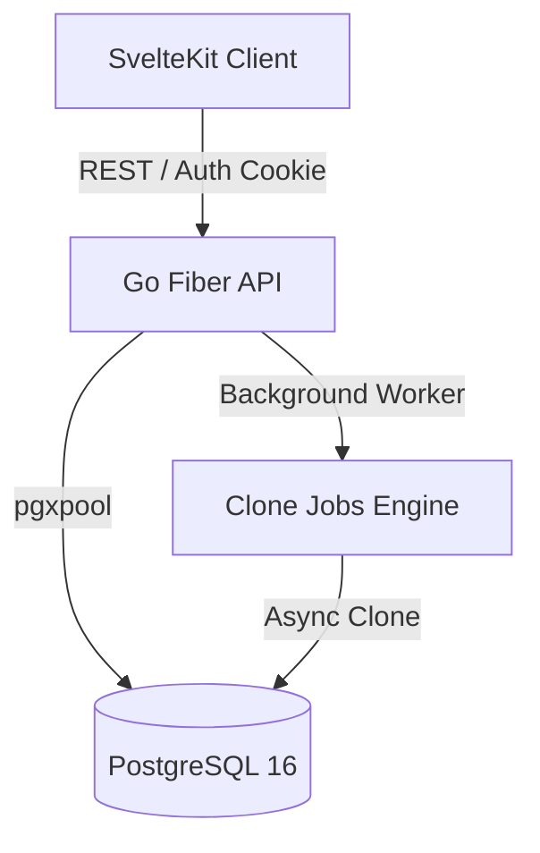

# RepEngine

[](https://github.com/momarinho/repengine/actions/workflows/ci.yml)
[](https://github.com/momarinho/repengine/actions/workflows/docker.yml)
[](https://opensource.org/licenses/MIT)

**RepEngine** is a high-performance, full-stack workout routine builder and player. It features a custom block-based editor, asynchronous templates cloning, real-time training execution tracking, and automatic progression/autoregulation recommendations based on logged set history (RPE/RIR).

Designed as a modern local-first-friendly SaaS web application, it bridges the gap between complex training block configurations and frictionless physical execution in the gym.

---

## 🏗️ System Architecture



---

## 🚀 Key Engineering & Architecture Showcases

This project is built using production-grade patterns, focusing on security, concurrency safety, data integrity, and high performance.

### 📊 1. Native SVG Analytics Engine (No Bloat)
*   **Custom Vector Charts**: Built a native SVG-based chart renderer using Svelte 5 runes (`$derived`, `$state`) to compute coordinate projection scales on the fly.
*   **Zero Dependencies**: Completely avoids loading heavy chart libraries (like Chart.js or D3), keeping the client bundle light and performant.
*   **Interactive Tooltips**: Supports mouse tracking to trigger tooltips displaying precise workout volume and RPE progression.

### 🔄 2. In-Memory Undo/Redo Engine
*   **Transactional History Stack**: Implemented a localized state manager in the editor using Svelte 5 to store deep-cloned snapshots of routine blocks.
*   **Shortcut Bindings**: Intercepts keyboard events for `Ctrl+Z` / `Cmd+Z` (Undo) and `Ctrl+Y` / `Cmd+Y` / `Ctrl+Shift+Z` (Redo).
*   **Visual Indicators**: Features polished, reactive action buttons in the workspace header that disable dynamically based on stack depth.

### 🧪 3. Playwright E2E Test Suite
*   **Full User Lifecycle Test**: Automates verification of critical paths: user registration, session-only login, workflow template design, real-time logging execution with rest-skipping simulation, and database persistence assertion on the history dashboard.
*   **Resilience & Stability**: Configured to run headlessly under Docker or local CI pipelines, protecting core features from regressions.

### 📖 4. Interactive API Documentation
*   **Embedded Spec Serving**: Serves the OpenAPI 3.0 specification (`openapi.yaml`) embedded directly into the Go binary using `go:embed`.
*   **Styled Swagger UI**: Integrated Swagger UI available at `/docs`, custom-themed using CSS filters to match RepEngine's dark-mode design system.

### 🛡️ 5. Concurrency & Data Integrity
*   **Optimistic Concurrency Control**: Edit conflicts in the block editor are prevented using timestamp comparisons (`updated_at`). If two editors update the same routine concurrently, the API rejects the slower request with a `409 Conflict` status, returning the server's current timestamp to allow client-side reconciliation.
*   **PostgreSQL Advisory Locks**: Schema migrations are applied automatically at boot via an embedded file system (`go:embed`). Execution is serialized across multiple application instances using transactional advisory locks to prevent concurrent schema corruption during rolling deployments.
*   **Relational Hardening**: Tight database schema constraints (`CHECK` blocks, cascading foreign keys, unified numeric metrics) maintain raw entry history while computing clean, normalized columns for progression logic.

### 🔒 6. Security & Hardening
*   **Secure Authentication**: Custom stateless JWT authentication with issuer/audience claims validation, secure-only cookies, token-revocation storage upon logout, and brute-force protection through rate limiters on registration/login endpoints.
*   **Least Privilege Execution**: Final production Docker containers drop root privileges and run under a minimal, dedicated `appuser` (using Alpine Linux), minimizing attack surfaces in host environments.

---

## 🛠️ Tech Stack

*   **Backend**: Go (v1.25), Fiber framework, `pgx/pgxpool` (native PostgreSQL driver), JWT, `slog` (structured logging), Prometheus metrics.
*   **Frontend**: SvelteKit (Svelte 5 runes), TypeScript, TailwindCSS, `localStorage` local runtime state.
*   **Database**: PostgreSQL 16.
*   **CI/CD & DevOps**: GitHub Actions (Linting, Tests, Docker Build & Push), Docker Compose, Nginx (TLS Termination).

---

## 🎮 Current Feature Surface

### Implemented
*   **Block-Based Editor**: Contextual block insertion supporting linear progression, wave loading, repeats, rest intervals, and timed exercises.
*   **Active Workout Player**: Real-time section execution, interactive timer/rest tracker, and set-by-set input logging (Load, Reps, RPE, RIR).
*   **Smart Progression Suggestions**: Real-time suggestion engine adjusting target loads/reps for linear and wave progression nodes based on completed set difficulty.
*   **Version History & Restore**: Automatic serialization of workflow snapshots with restore capabilities and rollback mechanisms.
*   **Account Settings**: Password resets, email/profile updates, and complete session invalidation on credential updates.
*   **Interactive API Docs**: Dynamic Swagger UI embedded directly into the Go binary at `/docs`.
*   **Progression Analytics**: Custom-built responsive SVG charts displaying training volume and RPE changes over time.
*   **Editor History Actions**: Built-in Undo/Redo stack with full Svelte 5 integration and hotkeys.

---

## 🏃 Running Locally

### With Docker (Recommended)

Start the entire stack (Database, API, and Web App):

```bash
docker compose -f docker-compose.dev.yml up --build
```

*   **Web App**: [http://localhost:3000](http://localhost:3000)
*   **API Service / Docs**: [http://localhost:8080/docs](http://localhost:8080/docs)
*   **API Healthcheck**: `curl http://localhost:8080/health`

---

## 🧪 Validation & Tests

### Backend Tests
Execute unit tests from `api/`:
```bash
CGO_ENABLED=0 go test ./...
```

### Frontend Checks
Validate TypeScript and Svelte syntax from `web/`:
```bash
npm run check
```

### E2E Integration Tests (Playwright)
Run end-to-end tests from `web/`:
```bash
npx playwright test
```

### Performance Benchmark
Run the workflow update benchmark from `api/` (requires a valid JWT):
```bash
export BENCH_TOKEN='YOUR_JWT_TOKEN'
go run ./cmd/bench_put_workflow
```

Latest local benchmark status: **PASS** (Avg: **4.10ms** / p95: **4.45ms**).

---

## 📄 License

This project is open-source software licensed under the [MIT License](LICENSE).
