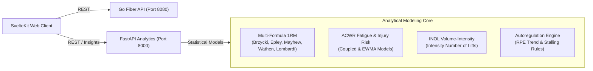

# RepEngine Analytics & Autoregulation Engine

A dedicated sports-science microservice built with **Python 3.12, FastAPI, and NumPy**, providing athletic intelligence, fatigue metrics, 1RM consensus calculations, and progressive overload autoregulation for RepEngine.

---

## 🎯 Architecture & Modeling Overview



---

## 🔬 Mathematical & Sports Science Foundations

### 1. One-Repetition Maximum (1RM) Consensus
Estimates maximal muscular capacity across 5 canonical formulas with RPE/RIR effective repetition adjustments:
- **Brzycki**: $\text{1RM} = \text{load} \cdot \frac{36}{37 - r_{\text{eff}}}$
- **Epley**: $\text{1RM} = \text{load} \cdot \left(1 + \frac{r_{\text{eff}}}{30}\right)$
- **Mayhew**: $\text{1RM} = \frac{100 \cdot \text{load}}{52.2 + 41.9 \cdot e^{-0.055 \cdot r_{\text{eff}}}}$
- **Wathen**: $\text{1RM} = \frac{100 \cdot \text{load}}{48.8 + 53.8 \cdot e^{-0.075 \cdot r_{\text{eff}}}}$
- **Lombardi**: $\text{1RM} = \text{load} \cdot r_{\text{eff}}^{0.10}$

Where $r_{\text{eff}} = \text{reps} + (10 - \text{RPE})$ or $\text{reps} + \text{RIR}$.
Outputs the statistical mean, standard deviation, 95% confidence interval ($\mu \pm 1.96 \cdot \frac{\sigma}{\sqrt{N}}$), and projected repetition maxes (1 to 12 reps).

### 2. Acute:Chronic Workload Ratio (ACWR)
Quantifies current training fatigue against historical fitness preparedness (Gabbett et al.):
- **Acute Workload**: Rolling 7-day volume load (fatigue accumulator).
- **Chronic Workload**: Rolling 28-day volume load (fitness foundation).
- **EWMA Smoothing**:
  $$\text{EWMA}_t = \text{Load}_t \cdot \lambda + (1 - \lambda) \cdot \text{EWMA}_{t-1}, \quad \lambda = \frac{2}{N + 1}$$
- **Zones**:
  - `< 0.8`: *Undertraining* (Fitness decay, vulnerable to spikes).
  - `0.8 - 1.3`: *Sweet Spot* (Optimal adaptation, lowest relative injury risk).
  - `1.3 - 1.5`: *Elevated Risk* (Fatigue outpacing recovery).
  - `> 1.5`: *Danger Zone* (High risk of non-functional overreaching / injury; deload recommended).

### 3. Intensity Number of Lifts (INOL)
Measures session fatigue stimulus (Hales et al.):
$$\text{INOL} = \sum_{i=1}^{k} \frac{\text{reps}_i}{100 - \text{intensity\%}_i}$$
- `< 0.4`: Recovery / Dynamic Effort.
- `0.4 - 1.0`: Optimal stimulus for standard training sessions.
- `1.0 - 1.5`: High fatigue (requires 48–72h recovery).
- `> 1.5`: Excessive stimulus (systemic exhaustion risk).

### 4. Autoregulation & Deload Recommender
Analyzes chronological workout history for progressive overload:
- **`increase_load`**: Target reps met with submaximal RPE ($\le 8.5$).
- **`maintain_load`**: Target reps met at maximal effort (RPE $\ge 9.5$) or single missed session.
- **`deload_intensity`**: 2 consecutive stalled sessions ($\ge 9.5$ RPE or missed reps).
- **`reset_cycle`**: 3 consecutive failures triggers a 15% periodization reset.

---

## 🚀 API Endpoints

| Method | Endpoint | Description |
|---|---|---|
| `GET` | `/health` | Service healthcheck & version probe |
| `POST` | `/api/v1/1rm` | Computes multi-formula 1RM consensus and reps table |
| `POST` | `/api/v1/acwr` | Computes coupled or EWMA ACWR fatigue ratio |
| `POST` | `/api/v1/inol` | Computes session volume/intensity INOL |
| `POST` | `/api/v1/autoregulation` | Analyzes performance trends and returns next session targets |

Interactive Swagger documentation is available at `/docs` and ReDoc at `/redoc`.

---

## 🧪 Testing

Run the test suite inside Docker:

```bash
docker run --rm -v $(pwd):/app -w /app python:3.12-slim bash -c "pip install -r requirements.txt && pytest -v"
```
