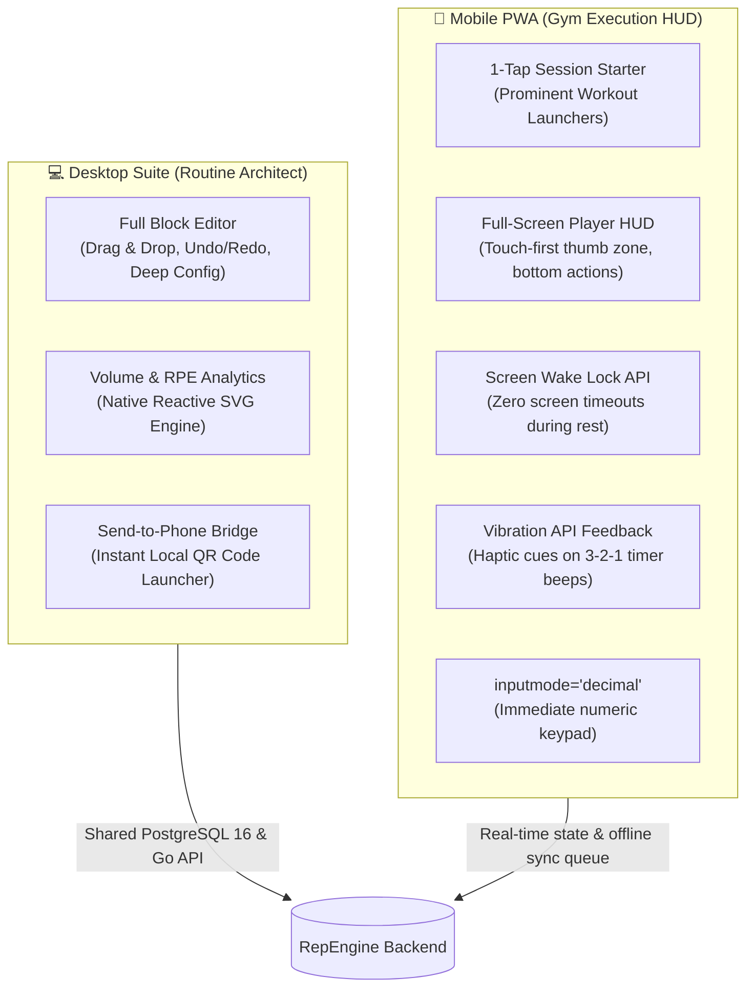

# Dual Workflow Architecture & Mobile Roadmap

## 🎯 Strategic Direction: Dual Workflow Model

The core philosophy of RepEngine is to eliminate context switching and physical friction during training:

- **Desktop (Routine Architect)**: High-information-density environment for planning, multi-week progression modeling, wave setups, and drag-and-drop routine engineering.
- **Mobile (Gym Execution HUD)**: Low-friction, 1-touch execution environment designed for sweaty hands, noisy gyms, and zero-distraction logging.

---

## 🏗️ Architectural Overview

---

## 📋 Implementation Phases

### Phase 1: Mobile Player "Gym-Ready" Polish
* [ ] **Screen Wake Lock API (`navigator.wakeLock`)**:
  - Request screen wake lock upon entering active workout sessions.
  - Automatically release on workout completion, abandonment, or visibility loss to preserve battery.
* [ ] **Native Numeric Keypads (`inputmode="decimal"` & `inputmode="numeric"`)**:
  - Add `inputmode` hints to actual load, reps, RPE, and RIR inputs across all block types (single exercise, waves, linear progression, supersets).
  - Ensures mobile OS immediately renders the large number dialpad instead of full alphanumeric QWERTY.
* [ ] **Haptic Feedback (Vibration API)**:
  - Integrate `navigator.vibrate([100, 50, 100])` synchronized with Web Audio countdown beeps (3-2-1) and interval round transitions.
  - Keeps athletes aware of rest/work phase switches even when phone is in pocket or earphones are loud.
* [ ] **Safe Area Insets (`env(safe-area-inset-bottom)`)**:
  - Add padding to fixed bottom action bar to respect iOS/Android gesture navigation bars.

### Phase 2: Action-Oriented Mobile Dashboard
* [ ] **Hero Workout Launcher**:
  - Highlight the most recent routine at the top of the mobile dashboard with a prominent "Start Workout" button for instant 1-tap entry.
* [ ] **Action Hierarchy Polish**:
  - Elevate "Start Workout" as the primary filled button on routine cards.
  - Keep "Edit" and "History" as secondary actions.

### Phase 3: Desktop "Routine Architect" & Mobile Bridge
* [ ] **Preserve Desktop Power**:
  - Keep the full multi-column canvas, inspector sidebar, hotkeys (`Ctrl+Z`, `Ctrl+Y`), and version rollback intact for desktop viewports.
* [ ] **Local QR Code Bridge**:
  - Add an "Open on Mobile" modal in the desktop editor/dashboard that renders a dynamic QR code pointing directly to the routine player on the local network IP.
* [ ] **Mobile Editor Awareness**:
  - Display an unobtrusive advisory banner on mobile screens when accessing the editor:
    *"💡 The block canvas is optimized for larger screens. You can edit here, or jump straight to the Workout Player."*

### Phase 4: Verification & Performance
* [ ] Maintain 100% test coverage across Go unit tests, SvelteKit checks, and Playwright E2E lifecycle tests.
* [ ] Verify seamless offline sync queue resilience under simulated network drops.
