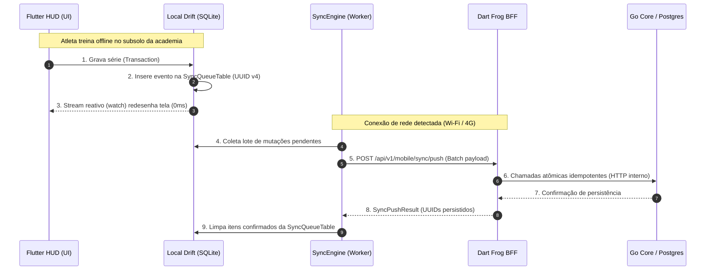

# 📱 RepEngine Mobile (Flutter + Drift + Dart Frog BFF)

[](https://flutter.dev)
[](https://dart.dev)
[](https://riverpod.dev)
[-003B57)](https://drift.simonbinder.eu)
[](https://dartfrog.vgv.dev)
[](https://opensource.org/licenses/MIT)

> **Offline-first workout execution HUD** designed for athletes in underground gym basements with zero cell reception. Features deterministic bidirectional synchronization, idempotent batch mutations, reactive SQLite streams, and hardware-accelerated workout tracking.

---

## 📲 Experimente no seu Celular (Download do APK)

Você não precisa compilar o código para avaliar este projeto. Escaneie o QR Code abaixo ou faça o download direto do APK Android gerado automaticamente pelo nosso pipeline de CI/CD:

| 📲 **Instalação Imediata (Android APK)** |
|:---:|
|  |
| [🔗 **Clique aqui para baixar o `.apk` direto da GitHub Release**](https://github.com/momarinho/repengine/releases/latest) |

*Dica de teste rápido*: Abra o app, ative o **Modo Avião** do seu telefone, registre um treino completo offline, desative o Modo Avião e veja a sincronização automática acontecer em segundo plano!

---

## 🏗️ Arquitetura de Sincronização & Padrão Outbox



---

## 🚀 Destaques de Engenharia Mobile

### 💾 1. Persistência Reativa com Drift (SQLite)
*   **Zero Latência na UI**: Leituras e escritas nunca aguardam requisições HTTP. A interface consome **Streams reativas (`watch()`)** do Drift, atualizando a tela instantaneamente (0ms de latência percebida).
*   **Tipagem Estática em SQL**: Consultas e migrações tipadas e validadas em tempo de compilação pelo gerador do Drift.

### 🔄 2. Padrão Outbox & Idempotência por UUID
*   **Resiliência Extrema**: Séries concluídas são gravadas localmente com UUIDs v4 exclusivos (`client_id`).
*   **Proteção contra Quedas no Meio do Envio**: Se a internet cair enquanto o servidor processa a resposta, a retransmissão subsequente do mesmo lote é ignorada pelo BFF, impedindo a duplicação de séries no banco de dados.

### 🌐 3. Sincronização Inteligente Local (PC ↔ Academia) & Continuidade de Progressões
*   **Heartbeat & Auto-Reconexão**: O app monitora a rede local e detecta automaticamente quando o Docker no PC está ativo, disparando o envio das séries e a busca de novas rotinas em segundo plano assim que o usuário entra no Wi-Fi.
*   **Continuidade de Progressões Offline**: Se o atleta executar múltiplos treinos seguidos sem ligar o PC, o motor de regras no `repengine_core` calcula os incrementos de carga da progressão linear localmente a partir do histórico no SQLite, garantindo que o atleta nunca treine sem prescrição atualizada.

### 🛡️ 4. Resolução Determinística de Conflitos (Treinador x Aluno)
*   **Regra de Ouro**: O esforço físico do atleta nunca é descartado. Se um treinador alterar a rotina no Desktop enquanto o aluno estava sem internet executando o treino:
    1. Os logs do aluno são salvos com prioridade absoluta no histórico.
    2. A rotina é atualizada para a nova versão do treinador com uma flag visual amigável: *"Nova versão da rotina aplicada para os próximos treinos"*.

### ⏱️ 5. Cronômetro Nativo CustomPainter (120 FPS)
*   Renderizado diretamente sobre o `Canvas` nativo do Flutter via `CustomPainter`, eliminando recomposições pesadas de widgets e garantindo 120 FPS cravados com consumo mínimo de bateria.

### 🔔 6. Notificações Interativas & Hardware
*   **Wake Lock**: Usa `wakelock_plus` para impedir o bloqueio automático de tela durante descansos.
*   **Haptics**: Vibrações táteis sincronizadas com a contagem de 3-2-1 segundos.
*   **Controle na Tela de Bloqueio**: Notificação persistente no Android permitindo avançar de série ou adicionar tempo (+30s) sem destravar o aparelho.

### 🧪 7. Pirâmide Completa de Testes
*   **Golden Tests**: Testes de regressão visual pixel-perfect para múltiplos temas (Dark/Light) e tamanhos de tela (iPhone SE ao Galaxy S24 Ultra).
*   **Testes Unitários com Riverpod**: Testes de estado isolados com `ProviderContainer`.
*   **Testes Drift In-Memory**: Testes de banco rodando sobre `NativeDatabase.memory()`, sem necessidade de emuladores para o CI.

---

## 🛠️ Stack Tecnológica Mobile

| Camada | Tecnologia | Motivação |
|---|---|---|
| **Framework** | Flutter 3.x (Dart 3.x) | Performance nativa (Impeller), portabilidade Android/iOS |
| **Gerenciamento de Estado** | Riverpod 2.x (`@riverpod`) | Estado imutável, reatividade desacoplada, alta testabilidade |
| **Banco Local** | Drift (SQLite) | Reatividade nativa com Streams `watch()`, DAOs e migrações tipadas |
| **BFF Mobile** | Dart Frog | Gateway em Dart para batch sync e desacoplamento do Core |
| **Comunicação de Rede** | Dio + Retry Interceptor | Interceptação de tokens, renovação e fila de retry com backoff |
| **Hardware** | `wakelock_plus`, `vibration` | Integrações físicas essenciais para uso em academia |
| **CI/CD** | GitHub Actions | Lint, testes automatizados e compilação do APK de release |

---

## 🏃 Como Rodar Localmente

### 1. Subir o Backend com Docker:
```bash
docker compose -f docker-compose.dev.yml up -d
```

### 2. Rodar o App Flutter:
```bash
cd mobile
flutter pub get
flutter run
```

### 3. Executar os Testes:
```bash
flutter test
```
