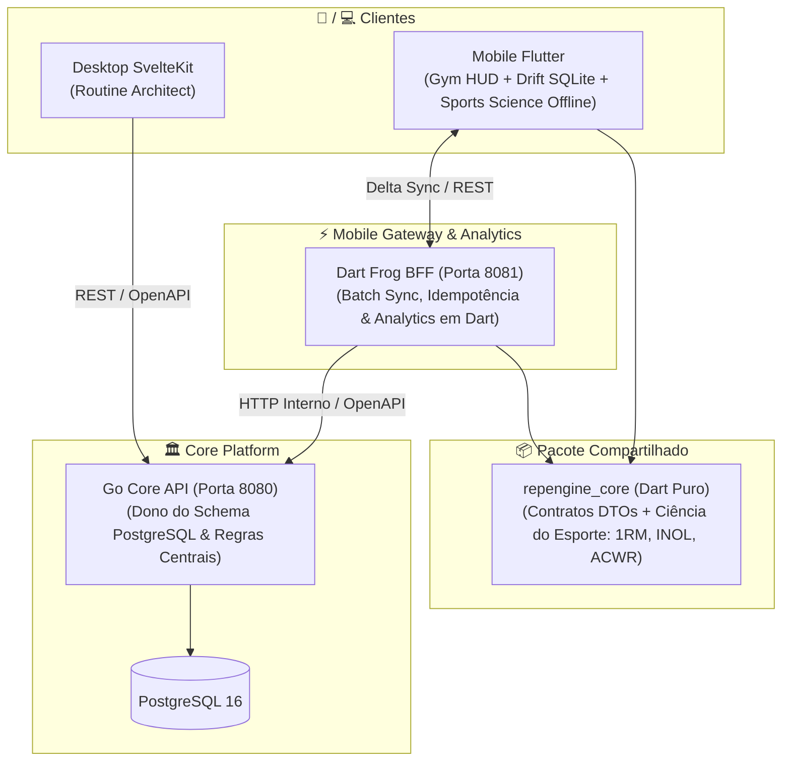

# RepEngine Mobile: Roadmap & Sprints (Flutter + Dart Frog BFF)

## 🎯 Visão do Produto & Estratégia de Engenharia

O objetivo deste projeto é construir um **produto mobile de nível sênior em Flutter e Dart**, focado em resolver um dos problemas mais difíceis da computação móvel: **Offline-First Synchronization com resolução determinística de conflitos**.

O app mobile atuará como o **Gym Execution HUD** da plataforma RepEngine, complementando o **Routine Architect (Desktop Web em SvelteKit)** sem qualquer regressão ou quebra no sistema existente.

---

## 🏛️ Arquitetura do Sistema e Fronteiras de Responsabilidade

### Fronteira Clara entre Serviços:
*   **Go Core API (Porta 8080)**:
    - Dono exclusivo do schema PostgreSQL e das migrations.
    - Aplica regras de negócio centrais, autenticação de sessão e travas concorrentes (advisory locks).
    - Expõe a especificação OpenAPI (`/swagger/openapi.yaml`).
*   **Dart Frog BFF (Porta 8081)**:
    - **NÃO toca no PostgreSQL diretamente**: consome a API do Go Core via rede interna do Docker.
    - Atua como gateway especializado para mobile: recebe lotes de mutações, garante idempotência via `client_id` (UUID), desempacota lotes em requisições atômicas e prepara respostas delta enxutas.
*   **Flutter App (`mobile/`)**:
    - Aplicação nativa (Android/iOS) baseada em **Riverpod 2.x** e **Drift (SQLite local)**.
    - Padrão **Outbox (Fila de Mutações)**: grava tudo no SQLite local primeiro; sincroniza em segundo plano quando houver conexão.

---

## 📋 Plano de Sprints

### 🛠️ SPRINT 0: Revisão de Schema & Evolução no Go Core
> **Objetivo**: Garantir que o banco de dados central suporte sincronização distribuída e idempotência sem regressão dos dados já persistidos.

- [x] **Auditoria de Schema**:
  - Verificar índices únicos e colunas existentes (`workout_set_logs.block_client_id`, `workflows.updated_at`).
- [x] **Migration Go Core `017_offline_sync_support.sql`**:
  - `ALTER TABLE workout_sessions ADD COLUMN IF NOT EXISTS client_id VARCHAR(100);` com índice único parcial.
  - `ALTER TABLE workflows ADD COLUMN IF NOT EXISTS deleted_at TIMESTAMP WITH TIME ZONE;` com índice.
  - `ALTER TABLE workout_set_logs ADD COLUMN IF NOT EXISTS client_id VARCHAR(100);` com índice único parcial.
- [x] **Verificação**:
  - Migrações automáticas aplicadas com sucesso no Go, queries e handlers atualizados com suporte a `client_id`, testes 100% aprovados.

---

### 📦 SPRINT 1: Geração de DTOs do OpenAPI & Pacote Compartilhado (`packages/repengine_core`)
> **Objetivo**: Estabelecer tipagem estática ponta a ponta sem duplicação manual de código entre Dart Frog e Flutter.

- [x] **Alinhamento com Contrato OpenAPI**:
  - OpenAPI [`openapi/openapi.yaml`](file:///home/mateus/Projects/repengine/openapi/openapi.yaml) atualizado com `client_id` e `deleted_at`.
- [x] **Pacote Compartilhado `packages/repengine_core`**:
  - Modelos de domínio e envelopes do protocolo de sincronização implementados em Dart puro (`lib/repengine_core.dart`):
    - `Workflow` e `WorkflowBlock`: Modelagem de rotinas do treinador com suporte a soft-delete.
    - `WorkoutSession` e `WorkoutSetLog`: Modelagem com identificador de cliente (`client_id`).
    - `SyncPushPayload`: Lote com sessões e séries concluídas offline pelo atleta.
    - `SyncPushResult` e `SyncPushItemStatus`: Recibo com status por item (`accepted`, `ignoredDuplicate`, `conflictFlagged`).
    - `SyncPullRequest`: Requisição com timestamp `last_synced_at`.
    - `SyncPullResponse`: Resposta delta com workflows atualizados e IDs de rotinas deletadas.
- [x] **Integração no Mobile & Testes da Sprint**:
  - App [`mobile/`](file:///home/mateus/Projects/repengine/mobile) configurado com arquitetura Feature-First e importando `repengine_core`.
  - Testes unitários de serialização em Dart (`dart test`) e testes de widget (`flutter test`) 100% aprovados sem alertas de análise.

---

### 🚀 SPRINT 2: Dart Frog BFF & Motor de Sincronização
> **Objetivo**: Construir o gateway de sincronização mobile em Dart Frog rodando no Docker.

- [x] **Estrutura Dart Frog**:
  - Configuração do projeto Dart Frog com injeção de dependência (`repengine_core`, client HTTP interno do Go Core).
  - Middleware de autenticação JWT compartilhando o mesmo segredo do Go.
- [x] **Endpoints de Sincronização**:
  - `POST /api/v1/mobile/sync/push`:
    - Recebe lote de mutações do Flutter.
    - Deduplicação por `client_id` (idempotência).
    - Despacha chamadas para o Go Core (`/workflows/:id/sessions`, `/workout-sessions/:id/logs`).
  - `GET /api/v1/mobile/sync/pull`:
    - Busca dados recentes no Go Core e devolve o delta filtrado por `updated_at`.
- [x] **Integração Docker**:
  - Adicionar o serviço `mobile-bff` ao `docker-compose.dev.yml` (porta 8081).
- [x] **Testes da Sprint**:
  - Testes de integração em Dart simulando retransmissão de lote para provar idempotência.

---

### 📱 SPRINT 3: Flutter Base, Riverpod 2.x & Drift (SQLite Local)
> **Objetivo**: Fundação do app Flutter com arquitetura Feature-First, banco local reativo e injeção de dependências.

- [x] **Configuração do Projeto Flutter & Design Tokens**:
  - Setup do projeto `mobile/` com Riverpod 2.x (`ProviderScope`, `@riverpod`) e `go_router`.
  - Design tokens (Atelier Dark Theme, tipografia Space Grotesk / Manrope).
- [x] **Drift Local Database (`AppDatabase`)**:
  - Tabelas: `RoutinesTable`, `WorkoutSessionsTable`, `WorkoutSetLogsTable`.
  - Tabela **`SyncQueueTable`**: `id`, `entity_client_id`, `entity_type`, `action`, `payload`, `status`, `attempts`.
  - Consultas reativas com **Streams (`watch()`)**: a UI escuta o Drift diretamente.
- [x] **Camada de Repositório**:
  - `WorkoutRepository`: Leitura sempre no Drift local (latência zero); escrita salva no Drift e insere na fila de sync.
- [x] **Testes da Sprint**:
  - Testes unitários de repositório e banco Drift em memória (`NativeDatabase.memory()`).

---

### 🔬 SPRINT 3.5: Ciência do Esporte em Dart Puro & Descomissionamento do Python
> **Objetivo**: Migrar 100% da inteligência analítica do microsserviço Python (`analytics/`) para Dart puro no pacote compartilhado `packages/repengine_core`, permitindo cálculos de 1RM, INOL e fadiga 100% offline no celular e servidos pelo Dart Frog BFF.

- [ ] **Módulo `repengine_core/sports_science`**:
  - `one_rep_max.dart`: Fórmulas analíticas (Brzycki, Epley, Mayhew, Wathen, Lombardi), média de consenso, desvio padrão e projeção de 1 a 12 repetições.
  - `inol.dart`: Intensity Number of Lifts por série e acumulado da sessão com zonas de fadiga e tempo de recuperação recomendado.
  - `workload_acwr.dart`: Acute:Chronic Workload Ratio (EWMA e coupled rolling window) para monitoramento de risco de lesão.
  - `autoregulation.dart`: Motor de ajuste fino de carga baseado no RPE/RIR real vs prescrito.
  - Testes unitários puros com 100% de paridade com as fórmulas anteriores do Python (`dart test`).
- [ ] **Exposição no Dart Frog BFF & Descomissionamento do Python**:
  - Dart Frog BFF expõe endpoints `/api/v1/analytics/*` consumindo o `repengine_core`.
  - Atualização do Desktop Web (SvelteKit) para apontar rotas de analytics para o BFF (`http://mobile-bff:8080`).
  - Remoção do contêiner `analytics` do `docker-compose.dev.yml` (economia de ~200MB de RAM e menos complexidade de deployment).

---

### 🔄 SPRINT 4: Motor de Sincronização no Flutter (Outbox Pattern)
> **Objetivo**: Tornar o app mobile 100% autônomo e resiliente a quedas de rede na academia.

- [ ] **`SyncEngine` (Worker em Dart)**:
  - Monitoramento de conexão com `connectivity_plus`.
  - **Fluxo ao detectar internet**:
    1. Lê a tabela `SyncQueueTable`.
    2. Dispara `POST /api/v1/mobile/sync/push` para o Dart Frog BFF.
    3. Remove os itens confirmados da fila local.
    4. Dispara Pull para receber novidades do servidor.
- [ ] **Resiliência e Políticas de Falha**:
  - Tratamento de erro 5xx e timeouts com backoff exponencial.
  - Indicador visual discreto de status de sync (Ícone de nuvem: *Sincronizado* / *Pendente offline*).
- [ ] **Testes da Sprint**:
  - Teste automatizado simulando interrupção de rede durante o sync push sem perda de registros.

---

### ⚡ SPRINT 5: Gym Execution HUD no Flutter
> **Objetivo**: Interface de treino físico de alta performance, ergonômica para uma mão só e integrada ao hardware.

- [ ] **UX para Academia (Thumb Zone)**:
  - Ações primárias ("Log Set", "Skip Rest") concentradas na base da tela.
  - Teclados numéricos nativos imediatos para carga e repetições.
- [ ] **CustomPainter Timer**:
  - Cronômetro circular suave desenhado em Canvas nativo (`CustomPainter`), rodando a 120 FPS sem rebuild de árvore desnecessário.
- [ ] **Hardware & Background**:
  - `wakelock_plus`: Impede que a tela apague durante os descansos.
  - `HapticFeedback`: Vibrações táteis na contagem regressiva 3-2-1.
  - `flutter_local_notifications`: Notificação persistente de cronômetro no Android para operar de tela bloqueada.
- [ ] **Painel de Diagnóstico Oculto (Debug Drawer)**:
  - Toque triplo no logo abre o painel de inspeção do Drift e botão para forçar simulação de falha de rede.

---

### 🏆 SPRINT 6: Conflito Real Treinador x Aluno, Golden Tests & CI/CD
> **Objetivo**: Fechar o produto com validação visual automatizada, gravação de demo e esteira de build do APK.

- [ ] **Cenário de Conflito Concorrente 100% Real**:
  - Aluno offline no Flutter conclui séries.
  - Treinador edita a carga do treino no SvelteKit desktop (persistido pelo Go).
  - Aluno fica online -> Flutter envia lote -> Dart Frog grava as séries no Go Core e aplica política explícita: *o esforço físico do aluno nunca é apagado; a rotina é atualizada para a nova versão com aviso amigável*.
- [ ] **Golden Tests (Regressão Visual)**:
  - Testes com `alchemist` / `golden_toolkit` garantindo layout perfeito em temas escuro/claro e telas pequenas.
- [ ] **Esteira CI/CD (GitHub Actions)**:
  - Pipeline que roda `dart analyze`, testes unitários do Dart Frog e Drift, e gera o APK Android compilado de release (`app-release.apk`).
- [ ] **README do Portfólio**:
  - QR Code para download direto do APK.
  - Demonstração em vídeo lado a lado: Desktop Web x Celular em Modo Avião.
