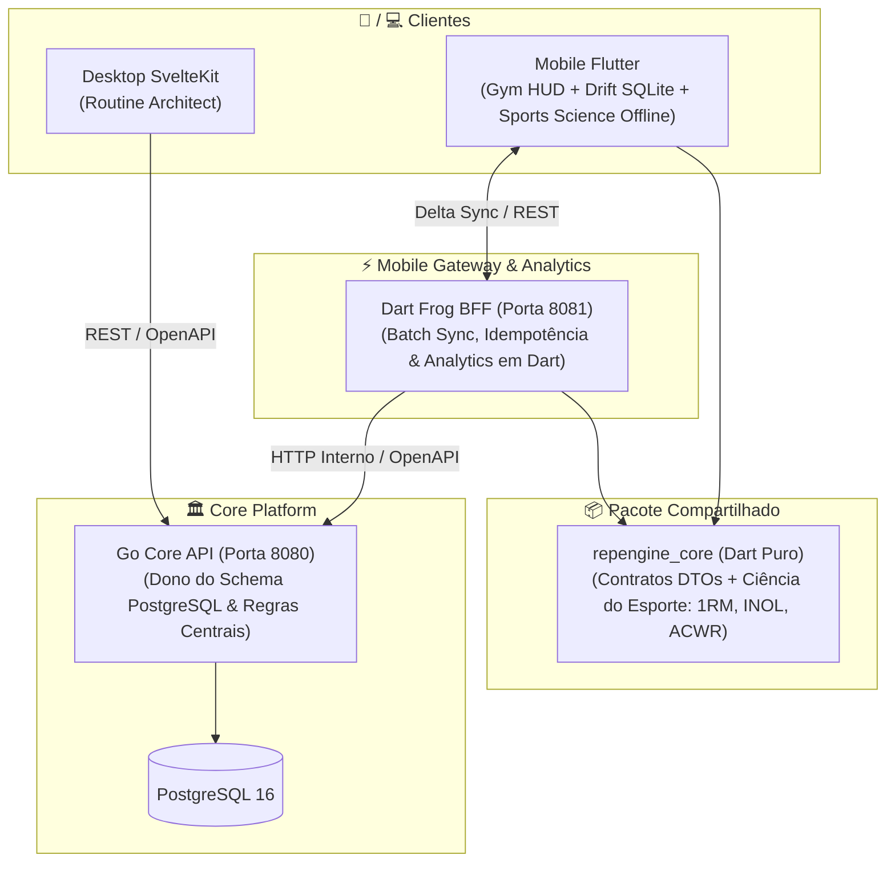

# RepEngine Mobile: Roadmap & Sprints (Flutter + Dart Frog BFF)

## 🎯 Visão do Produto & Estratégia de Engenharia

O objetivo deste projeto é construir um **produto mobile de nível sênior em Flutter e Dart**, focado em resolver um dos problemas mais difíceis da computação móvel: **Offline-First Synchronization com resolução determinística de conflitos**.

O app mobile atuará como o **Gym Execution HUD** da plataforma RepEngine, complementando o **Routine Architect (Desktop Web em SvelteKit)** sem qualquer regressão ou quebra no sistema existente.

---

## 🏛️ Arquitetura do Sistema e Fronteiras de Responsabilidade

### Fronteira Clara entre Serviços:
*   **Go Core API (Porta 8080)**:
    - Dono exclusivo do schema PostgreSQL e das migrations.
    - Aplica regras de negócio centrais, autenticação de sessão e travas concorrentes (advisory locks).
    - Expõe a especificação OpenAPI (`/swagger/openapi.yaml`).
*   **Dart Frog BFF (Porta 8081)**:
    - **NÃO toca no PostgreSQL diretamente**: consome a API do Go Core via rede interna do Docker.
    - Atua como gateway especializado para mobile: recebe lotes de mutações, garante idempotência via `client_id` (UUID), desempacota lotes em requisições atômicas e prepara respostas delta enxutas.
*   **Flutter App (`mobile/`)**:
    - Aplicação nativa (Android/iOS) baseada em **Riverpod 2.x** e **Drift (SQLite local)**.
    - Padrão **Outbox (Fila de Mutações)**: grava tudo no SQLite local primeiro; sincroniza em segundo plano quando houver conexão.

### 🌐 Ciclo de Sincronização Inteligente (PC Local ↔ Modo Academia)
*   **1. Em Casa (Mesmo Wi-Fi do PC / Docker Ativo)**:
    - O app Flutter detecta automaticamente o backend via heartbeat no IP configurado.
    - Dispara o *Pull*: baixa rotinas novas/editadas no PC e os estados de progressão atuais (`progression_states` com cargas sugeridas e semanas ativas).
*   **2. Na Academia (Modo Offline / Sem PC)**:
    - O app opera com total autonomia e latência zero (0ms) no SQLite local.
    - O atleta executa treinos, consulta cargas prescritas e tem os incrementos de progressão calculados localmente no Flutter caso faça múltiplos treinos seguidos sem ligar o PC.
    - Cada série finalizada é inserida na `SyncQueueTable` com UUID v4 idempotente.
*   **3. Ao Retornar para Casa ou Subir o Docker no PC**:
    - Assim que os containers do Docker sobem no PC ou o celular entra no Wi-Fi, o worker detecta o servidor ativo e faz o *Push* em lote silencioso, descarregando as séries no PostgreSQL.

---

## 📋 Plano de Sprints

### 🛠️ SPRINT 0: Revisão de Schema & Evolução no Go Core
> **Objetivo**: Garantir que o banco de dados central suporte sincronização distribuída e idempotência sem regressão dos dados já persistidos.

- [x] **Auditoria de Schema**:
  - Verificar índices únicos e colunas existentes (`workout_set_logs.block_client_id`, `workflows.updated_at`).
- [x] **Migration Go Core `017_offline_sync_support.sql`**:
  - `ALTER TABLE workout_sessions ADD COLUMN IF NOT EXISTS client_id VARCHAR(100);` com índice único parcial.
  - `ALTER TABLE workflows ADD COLUMN IF NOT EXISTS deleted_at TIMESTAMP WITH TIME ZONE;` com índice.
  - `ALTER TABLE workout_set_logs ADD COLUMN IF NOT EXISTS client_id VARCHAR(100);` com índice único parcial.
- [x] **Verificação**:
  - Migrações automáticas aplicadas com sucesso no Go, queries e handlers atualizados com suporte a `client_id`, testes 100% aprovados.

---

### 📦 SPRINT 1: Geração de DTOs do OpenAPI & Pacote Compartilhado (`packages/repengine_core`)
> **Objetivo**: Estabelecer tipagem estática ponta a ponta sem duplicação manual de código entre Dart Frog e Flutter.

- [x] **Alinhamento com Contrato OpenAPI**:
  - OpenAPI [`openapi/openapi.yaml`](file:///home/mateus/Projects/repengine/openapi/openapi.yaml) atualizado com `client_id` e `deleted_at`.
- [x] **Pacote Compartilhado `packages/repengine_core`**:
  - Modelos de domínio e envelopes do protocolo de sincronização implementados em Dart puro (`lib/repengine_core.dart`):
    - `Workflow` e `WorkflowBlock`: Modelagem de rotinas do treinador com suporte a soft-delete.
    - `WorkoutSession` e `WorkoutSetLog`: Modelagem com identificador de cliente (`client_id`).
    - `SyncPushPayload`: Lote com sessões e séries concluídas offline pelo atleta.
    - `SyncPushResult` e `SyncPushItemStatus`: Recibo com status por item (`accepted`, `ignoredDuplicate`, `conflictFlagged`).
    - `SyncPullRequest`: Requisição com timestamp `last_synced_at`.
    - `SyncPullResponse`: Resposta delta com workflows atualizados e IDs de rotinas deletadas.
- [x] **Integração no Mobile & Testes da Sprint**:
  - App [`mobile/`](file:///home/mateus/Projects/repengine/mobile) configurado com arquitetura Feature-First e importando `repengine_core`.
  - Testes unitários de serialização em Dart (`dart test`) e testes de widget (`flutter test`) 100% aprovados sem alertas de análise.

---

### 🚀 SPRINT 2: Dart Frog BFF & Motor de Sincronização
> **Objetivo**: Construir o gateway de sincronização mobile em Dart Frog rodando no Docker.

- [x] **Estrutura Dart Frog**:
  - Configuração do projeto Dart Frog com injeção de dependência (`repengine_core`, client HTTP interno do Go Core).
  - Middleware de autenticação JWT compartilhando o mesmo segredo do Go.
- [x] **Endpoints de Sincronização**:
  - `POST /api/v1/mobile/sync/push`:
    - Recebe lote de mutações do Flutter.
    - Deduplicação por `client_id` (idempotência).
    - Despacha chamadas para o Go Core (`/workflows/:id/sessions`, `/workout-sessions/:id/logs`).
  - `GET /api/v1/mobile/sync/pull`:
    - Busca dados recentes no Go Core e devolve o delta filtrado por `updated_at`.
- [x] **Integração Docker**:
  - Adicionar o serviço `mobile-bff` ao `docker-compose.dev.yml` (porta 8081).
- [x] **Testes da Sprint**:
  - Testes de integração em Dart simulando retransmissão de lote para provar idempotência.

---

### 📱 SPRINT 3: Flutter Base, Riverpod 2.x & Drift (SQLite Local)
> **Objetivo**: Fundação do app Flutter com arquitetura Feature-First, banco local reativo e injeção de dependências.

- [x] **Configuração do Projeto Flutter & Design Tokens**:
  - Setup do projeto `mobile/` com Riverpod 2.x (`ProviderScope`, `@riverpod`) e `go_router`.
  - Design tokens (Atelier Dark Theme, tipografia Space Grotesk / Manrope).
- [x] **Drift Local Database (`AppDatabase`)**:
  - Tabelas: `RoutinesTable`, `WorkoutSessionsTable`, `WorkoutSetLogsTable`.
  - Tabela **`SyncQueueTable`**: `id`, `entity_client_id`, `entity_type`, `action`, `payload`, `status`, `attempts`.
  - Consultas reativas com **Streams (`watch()`)**: a UI escuta o Drift diretamente.
- [x] **Camada de Repositório**:
  - `WorkoutRepository`: Leitura sempre no Drift local (latência zero); escrita salva no Drift e insere na fila de sync.
- [x] **Testes da Sprint**:
  - Testes unitários de repositório e banco Drift em memória (`NativeDatabase.memory()`).

---

### ⚡ SPRINT 4 (Fatia Vertical 1): Gym Execution HUD + Ciência do Esporte (1RM/Fadiga) em Tempo Real
> **Objetivo**: Unir a interface visual do Flutter com o motor local Drift e a matemática de 1RM do `repengine_core`. O atleta inicia um treino, digita carga/reps, vê o 1RM estimado sendo calculado em tempo real na tela, conclui séries com feedback tátil e vê a lista e o timer reagirem ao vivo a 120 FPS.

- [x] **Módulo `repengine_core/sports_science` (1RM, INOL, ACWR & Autoregulação)**:
  - Fórmulas analíticas (Brzycki, Epley, Mayhew, Wathen, Lombardi), zonas de recuperação INOL, ratio ACWR e motor de autorregulação por RPE em Dart puro.
  - Testes unitários puros com 100% de paridade com o Python (`dart test` aprovado com 9 testes).
- [x] **Interface do Gym Execution HUD (`mobile/lib/features/workout_execution/presentation/`)**:
  - Tela principal com header da sessão ativa e cards de exercícios com o tema Atelier Dark.
  - Componente ergonômico *Thumb Zone* com inputs de Carga e Reps.
  - Botão "Concluir Série" disparando gravação atômica no SQLite via `WorkoutRepository`.
  - Lista reativa de séries concluídas atualizando via `StreamProvider`.
  - Modal de resumo de conclusão de treino (`WorkoutSummaryDialog`) com volume total (kg) e tempo.
- [x] **Cronômetro Circular em Canvas (`CustomPainter`)**:
  - Timer de descanso animado desenhado em Canvas nativo a 120 FPS sem rebuild desnecessário da árvore.
  - `HapticFeedback` vibratório nos 3 segundos finais do descanso.
- [x] **Conexão Direta do Módulo de 1RM no Flutter**:
  - Conectar `OneRepMaxCalculator` no `ThumbZonePad` e `SetLogCard` para cálculo de consenso estatístico em tempo real.

---

### 🐍 ➔ 🎯 SPRINT 4.5: Exposição no Dart Frog BFF & Substituição do Python no Desktop Web
> **Objetivo**: Fazer a Web Desktop (SvelteKit) consumir o módulo de Ciência do Esporte em Dart através do Dart Frog BFF, possibilitando o desligamento e remoção definitiva do contêiner Python do Docker Compose.

- [x] **Endpoints Analíticos no Dart Frog BFF (`server_mobile/routes/api/v1/`)**:
  - `POST /api/v1/1rm`: Consome `OneRepMaxCalculator` e retorna o mesmo JSON que o Python retornava.
  - `POST /api/v1/autoregulation`: Consome `AutoregulationEngine` formatando ações para snake_case (`increase_load`, etc.).
  - `POST /api/v1/acwr`: Consome `ACWRCalculator` com zonas ótimas e recomendações.
  - Validação via testes de integração e chamadas `curl`.
- [x] **Virada de Chave no Desktop Web (SvelteKit)**:
  - Atualizar `docker-compose.dev.yml` para apontar `ANALYTICS_URL: http://mobile-bff:8080`.
  - Confirmar renderização do card `ScientificInsights` na Web sem alterar uma linha sequer de Svelte/HTML.
- [x] **Descomissionamento do Microsserviço Python**:
  - Remover serviço `analytics` do `docker-compose.dev.yml` (economia de ~200MB de RAM e menos complexidade de deploy).

---

### 🔄 SPRINT 5 (Fatia Vertical 2): Sincronização Inteligente Ponta a Ponta (Outbox Worker ↔ Dart Frog BFF) & Status Visual
> **Objetivo**: Conectar o SQLite local com o Dart Frog BFF via rede local, viabilizando o fluxo "planeja no PC ➔ executa offline na academia ➔ sincroniza automaticamente ao reconectar", incluindo a descida e continuidade das progressões e ferramentas de diagnóstico.

- [x] **Configuração Dinâmica do Host do PC & Health Check**:
  - Persistência do IP local da máquina via `shared_preferences` (`ServerConfigNotifier`).
  - Endpoint `GET /api/v1/health` ativo no BFF e botão de teste de Ping com latência na UI.
- [x] **Indicador Visual de Nuvem & "Modo Academia" (Cloud Sync Badge)**:
  - Widget na AppBar observando status da rede e fila Drift (🟢 Sincronizado, 🟡 Modo Academia, 🔵 Testando, ⚪ PC Offline).
- [x] **Painel de Diagnóstico Oculto & Ajustes de Rede (Debug & Settings Drawer)**:
  - Gaveta com edição de IP, teste de ping, simulação de offline e inspetor da fila local `SyncQueueTable`.
- [x] **Worker de Sincronização Inteligente (`SyncEngine` & `SyncHttpClient`)**:
  - Monitoramento de conectividade (`connectivity_plus`) e auto-sync ao reconectar.
  - Varredura da `SyncQueueTable` do Drift e despacho em lote para `POST /api/v1/mobile/sync/push`.
  - Confirmação e expurgo atômico dos itens enviados da fila local com base no recibo `SyncPushResult`.
  - Disparo de `GET /api/v1/mobile/sync/pull` para buscar rotinas e novidades do servidor.
- [x] **Sincronização e Continuidade de Progressões (`progression_states`)**:
  - DTO de `ProgressionState` no `repengine_core` e retorno no `SyncPullResponse`.
  - Persistência de cargas sugeridas no Drift local (`ProgressionStatesTable`).
  - Fallback offline para cálculo de incremento linear no Flutter quando múltiplos treinos forem executados longe do PC.
    - Inspecionar itens acumulados na fila SQLite (`SyncQueueTable`).
    - Simular falhas de rede e modo offline forçado.

---

### 🏆 SPRINT 6 (Fatia Vertical 3): Conflito Real Aluno x Treinador, Golden Tests & CI/CD
> **Objetivo**: Finalizar o produto com reconciliação determinística de conflitos, cobertura de regressão visual, seletor offline de rotinas e dias, e esteira automatizada de release do APK.

- [x] **Dashboard de Seleção de Rotinas e Dias/Seções Offline**:
  - `RoutineSelectorView` renderizando cartões de rotinas sincronizadas e chips horizontais de dias/seções (`RoutineSection`).
  - Prévia rica de exercícios prescritos (séries, repetições, carga recomendada e tempo de descanso).
  - Alternância rápida entre exercícios dentro do HUD ativo com atualização reativa do `ThumbZonePad` e cálculo individual de sobrecarga.
  - Coluna `blocksJson` no Drift (`RoutinesTable`) serializando blocos da rotina em JSON estruturado para execução 100% offline.
- [x] **Resolução Determinística de Conflitos no Dart Frog & Flutter**:
  - Cenário concorrente real: Treinador edita no SvelteKit ↔ Aluno conclui série offline na academia.
  - Regra de negócio comprovada em teste automatizado (`deterministic_conflict_resolution_test.dart`): esforço físico do atleta nunca é descartado; séries locais usam `client_id` e são aceitas; rotina local atualiza atomicamente via delta pull.
- [x] **Testes de Regressão Visual & Design System Ergômico**:
  - Testes automatizados em `hud_visual_test.dart` cobrindo tokens da paleta Kanagawa Dark, hierarquia tipográfica e touch targets mínimos de 48-54dp.
  - Responsividade sem qualquer overflow em resoluções de smartphones compactos a flagships via `FittedBox`.
- [x] **Esteira de Integração Contínua (CI/CD) no GitHub Actions**:
  - Pipeline `.github/workflows/ci.yml` estendido com 4 novos jobs: `core-test`, `bff-test`, `mobile-test` e `mobile-build-apk` compilando e publicando o artefato de release do APK.

---

### 🔐 SPRINT 7: Autenticação Real do Atleta & Conexão com Conta Web Desktop
> **Objetivo**: Conectar o aplicativo mobile à conta real do usuário criada no Desktop Web, substituindo os dados de demonstração offline por treinos, seções e exercícios reais criados na plataforma Web do RepEngine.

- [x] **Hidratação de Blocos de Rotina no Dart Frog BFF (`server_mobile`)**:
  - `GoCoreClient.fetchWorkflows`: Enriquecimento da listagem básica com chamadas concorrentes a `GET /workflows/:id` para obter todos os blocos estruturados (`blocksJson`).
  - Blocos de seções (`section`), exercícios (`exercise`), progressões lineares (`linear_progression`) e descansos entregues completos no `SyncPullResponse`.
- [x] **Proxy de Autenticação no BFF (`server_mobile/routes/api/v1/mobile/auth/login.dart`)**:
  - Rota `POST /api/v1/mobile/auth/login` repassando credenciais do atleta ao Go Core (`POST /auth/login`).
  - Middleware atualizado com bypass seguro para endpoints de autenticação pública.
  - Exceção estruturada `GoCoreAuthException` preservando status codes HTTP 400/401/500 do Go Core.
- [x] **Gerenciamento de Sessão & Token no Flutter (`features/auth`)**:
  - `AuthState` e `AuthNotifier` gerenciando status (`guest`, `authenticating`, `authenticated`, `error`).
  - Persistência segura de `token`, `user_id` e `email` no `SharedPreferences`.
  - Injeção dinâmica do JWT do atleta autenticado no `SyncHttpClient` (`Authorization: Bearer <token>`).
  - Disparo de sincronização imediata (`syncNow()`) no momento do login.
- [x] **Interface do Atleta na Gaveta de Configurações & Seletor de Rotinas**:
  - Card "Conta RepEngine Web" no `DebugSettingsDrawer` com campos de login, feedback de erro e botão de desconexão.
  - Banner informativo dinâmico em `RoutineSelectorView` indicando se o app está em modo offline de demonstração ou conectado à conta Web real.
- [x] **Testes Automatizados**:
  - 100% de aprovação nos testes do BFF (`go_core_client_test.dart`, `login_test.dart`, `_middleware_test.dart`).
  - Testes unitários do `AuthNotifier` no Flutter (`auth_notifier_test.dart`).
  - Zero erros e advertências no `flutter analyze`.

---

### 🏗️ SPRINT 8: Criador de Rotinas no Mobile (Mobile Routine Creator) & Recursos de Portfólio
> **Objetivo**: Dar autonomia completa ao aplicativo mobile, permitindo que o atleta crie, customize e execute suas próprias rotinas e dias de treino diretamente pelo celular com 100% de persistência offline no SQLite, gerando blocos estruturados (`blocksJson`) e sincronizando com o backend.

- [x] **Abandono de Treino com Purga Atômica (Abandon Workout)**:
  - Botão de abandono rápido na barra de status da sessão ativa e botão alternativo "Discard Workout" no [`WorkoutSummaryDialog`](file:///home/mateus/Projects/repengine/mobile/lib/features/workout_execution/presentation/widgets/workout_summary_dialog.dart).
  - Modal de confirmação ergonômico [`AbandonWorkoutDialog`](file:///home/mateus/Projects/repengine/mobile/lib/features/workout_execution/presentation/widgets/abandon_workout_dialog.dart) prevenindo toques acidentais.
  - Purga transacional atômica no SQLite via `WorkoutRepository.abandonSession`: deleção da sessão ativa, séries temporárias e remoção das mutações pendentes na outbox (`SyncQueueTable`), impedindo que treinos cancelados subam para o servidor.
  - 100% de cobertura de testes automatizados unitários e de widget (`workout_repository_test.dart` e `workout_execution_screen_test.dart`).
- [x] **Fluxo Ergonômico de Criação de Rotina (`RoutineCreatorScreen` / Modal)**:
  - Metadados da rotina: Nome e descrição.
  - Construtor dinâmico de seções (dias de treino): adicionar/remover seções (ex: "Day 1 - Push", "Day 2 - Pull").
  - Adição de exercícios por seção com catálogo rápido pré-configurado (*Squat, Bench Press, Deadlift, OHP, Barbell Row, etc.*) ou nome livre.
  - Prescrição por exercício: séries (sets), repetições alvo, carga recomendada inicial (kg) e tempo de descanso (segundos).
- [x] **Persistência Estruturada no SQLite (`WorkoutRepository.createRoutine`)**:
  - Serialização determinística dos blocos no formato nativo de `blocksJson` compatível com o parser `routine_model.dart`.
  - Inserção atômica no Drift local (`RoutinesTable`) e reflexo imediato no `watchRoutines()`.
  - Enfileiramento na `SyncQueueTable` para replicação no Go Core.
- [x] **Ponto de Entrada e Integração na UI**:
  - Botão de ação destacado `+ Create Routine` integrado ao [`RoutineSelectorView`](file:///home/mateus/Projects/repengine/mobile/lib/features/workout_execution/presentation/widgets/routine_selector_view.dart).
  - Seleção e execução imediata do treino recém-criado com HUD ativo, cronômetro de descanso pré-configurado e cálculo de 1RM.
- [x] **Calculadora de Anilhas (*Plate Calculator*) Integrada ao HUD**:
  - Widget ergonômico no `ThumbZonePad`, AppBar e Dashboard decompondo qualquer carga alvo nas anilhas necessárias para barra olímpica (25kg, 20kg, 15kg, 10kg, 5kg, 2.5kg, 1.25kg) com seletor de barra e badges visuais por cores oficiais.
  - Testes de widget automatizados em `plate_calculator_test.dart`.
- [x] **Histórico Local de Treinos Concluídos (`WorkoutHistoryView`)**:
  - Tela completa para consultar treinos passados, logs de séries, duração e volume total computados do SQLite local, com detalhamento expansível de exercícios e opção de exclusão.
  - Testes de widget automatizados em `workout_history_test.dart`.
- [x] **Testes Automatizados**:
  - Testes unitários de repositório e testes de widget para criação e edição de rotinas no celular (`routine_editor_test.dart`), calculadora de anilhas (`plate_calculator_test.dart`) e histórico (`workout_history_test.dart`).

---

### 🏋️‍♂️ SPRINT 9: Ergonomia de Academia, Edição Durante o Treino & Sobrescrita de Rotina
> **Objetivo**: Elevar a usabilidade do aplicativo para o padrão "Gym-Proof", com tipografia de alta legibilidade, botões de toque amplo, linguagem humana sem jargões técnicos, edição rápida de exercícios em sessão ativa (para aparelhos ocupados) e pergunta inteligente de atualização da rotina base ao finalizar o treino.

- [x] **Ergonomia e Legibilidade de Academia (*Gym-Proof HUD*)**:
  - Tipografia de alto contraste e relance rápido (24–32px) para métricas principais (carga, repetições, número da série).
  - Touch targets ampliados no `ThumbZonePad` (mínimo 48–56dp) para digitação e ajuste rápido mesmo com mãos suadas.
  - Cronômetro de descanso em destaque com feedback visual e sonoro/vibração.
- [x] **Linguagem Amigável & Desacoplamento Técnico**:
  - Substituição de termos de engenharia ("BFF Host", "Outbox", "Consensus 1RM", "Autoregulated target") por termos intuitivos do atleta ("Nuvem / Sincronização", "Recorde estimado (1RM)", "Meta sugerida").
  - Gaveta de configurações reorganizada com foco em status simples e seção expansível de configurações avançadas.
- [x] **Edição Rápida Durante o Treino (*In-Workout Quick Edit*)**:
  - Substituição de exercício na sessão ativa (ex: máquina ocupada, trocar barra por halteres).
  - Adição de exercício avulso à sessão de hoje.
  - Remoção de exercício da sessão do dia.
- [x] **Sobrescrita Inteligente da Rotina Base ao Concluir Treino**:
  - Resumo de conclusão com comparação entre cargas prescritas vs executadas.
  - Opção de salvar novos recordes e cargas na rotina base (`routines.blocksJson`) no SQLite local para a próxima semana.
  - Opção de salvar somente o histórico do treino de hoje sem alterar a rotina original.
- [x] **Testes Automatizados**:
  - Testes unitários para substituição de exercícios e atualização de blocos de rotina.
  - Testes de widget para o modal inteligente de conclusão e novo HUD ampliado.

---

### 📱 SPRINT 10: Autenticação Limpa & Editor Completo de Rotinas no Mobile
> **Objetivo**: Conceder independência total do desktop ao atleta, com tela de login amigável e editor nativo completo de rotinas diretamente no celular.

- [x] **Fluxo de Autenticação Oficial & Perfil**:
  - Tela de boas-vindas com opções de login na Conta RepEngine Web ou "Treinar Offline / Convidado".
  - Tela de perfil para visualização de conta, status de sincronização e desconexão.
- [x] **Editor de Rotinas Mobile (`RoutineEditorScreen`)**:
  - Formulário completo para criar e editar rotinas, seções/dias e exercícios pelo celular.
  - Prescrição de séries, repetições, carga e descansos salvos atomicamente no SQLite local e sincronizados via Outbox.
- [x] **Testes Automatizados**:
  - Testes de widget para autenticação (`athlete_auth_screen_test.dart`) e editor de rotinas (`routine_editor_test.dart`).

---

### 🤖 SPRINT 11: RepEngine AI Copilot (Coach Generativo & Smart Workout Debrief)
> **Objetivo**: Integrar inteligência artificial aplicada ao ecossistema RepEngine para eliminar a fricção no planejamento de rotinas e fornecer análises qualitativas de desempenho esportivo, preservando integralmente o determinismo matemático do Go Core e a autonomia Offline-First do Flutter.

- [x] **Fronteira Arquitetural & Princípios de Engenharia**:
  - **Determinismo Preservado**: Fórmulas de sobrecarga progressiva, cálculos de 1RM e integridade relacional permanecem 100% no Go Core (`api/`).
  - **Offline-First Intocado**: A execução na academia e o registro de séries continuam 100% locais no SQLite/Drift, sem dependência de internet.
  - **IA Assíncrona & Resiliente**: Chamadas de IA ocorrem em momentos conectados (criação de rotina pré-treino ou análise após sync push), com fallbacks graciosos caso esteja offline.
- [x] **Coach Copilot: Gerador de Rotinas em Linguagem Natural (Google Genkit)**:
  - Endpoint no Dart Frog BFF (`POST /api/v1/mobile/ai/generate_routine`) integrando Google Gemini 1.5 Flash via **Google Genkit 1.0** e **Structured JSON Outputs**.
  - O treinador ou atleta digita ou seleciona: *"Treino Upper/Lower de 4 dias para hipertrofia, evitando supino com barra devido a desconforto no ombro"*.
  - O LLM gera um payload estruturado compatível diretamente com a especificação `blocksJson` (`section`, `exercise`, `sets`, `reps`, `rest_time`, `target_load`).
  - Botão "Criar com IA" no `RoutineSelectorView` / `RoutineEditorScreen` do Flutter.
  - **Web AI Workout Architect (`AiArchitectModal.svelte`)**: No Web SvelteKit, modal avançado permitindo configurar objetivo, divisão, nível, equipamentos, restrições e aplicar diretamente ao Canvas (Substituir ou Anexar).
- [ ] **Smart Workout Debrief (Análise Pós-Treino com Insights Esportivos)**:
  - Disparado automaticamente após o sucesso do *sync push* da sessão de treino.
  - Compara a prescrição teórica com os logs executados (volume total levantado, quebra de recordes de 1RM, tempo médio de descanso e consistência de RPE).
  - Gera um resumo técnico e motivacional armazenado localmente e exibido no `WorkoutHistoryView` e no resumo da web.
- [ ] **Smart Exercise Substitution (Substituição Biomecânica Inteligente)**:
  - Assistente contextual no modal de substituição durante o treino ativo: quando uma máquina estiver ocupada, sugere 2 a 3 alternativas viáveis com base nos mesmos grupos musculares e padrões de movimento (ex: Leg Press ocupado -> Agachamento Búlgaro com halteres), ajustando a meta de carga sugerida.
- [x] **Guardrails de Segurança Física & Fallbacks**:
  - System prompts com regras estritas de ciência do esporte (limites máximos de volume por grupo muscular, prevenção de exercícios com contraindicação).
  - Tratamento de timeout e indisponibilidade de rede com mensagens claras ao usuário e código HTTP 503 controlado se a API key não for configurada.
- [x] **Testes Automatizados & Validação**:
  - Testes unitários para parsing e validação de schema do JSON gerado pela IA no BFF (`gemini_client_test.dart` e `generate_routine_test.dart` - 39 testes).
  - Testes de widget no Flutter para os fluxos com IA (`ai_routine_dialog_test.dart` e `ai_copilot_service_test.dart` - 64 testes).

