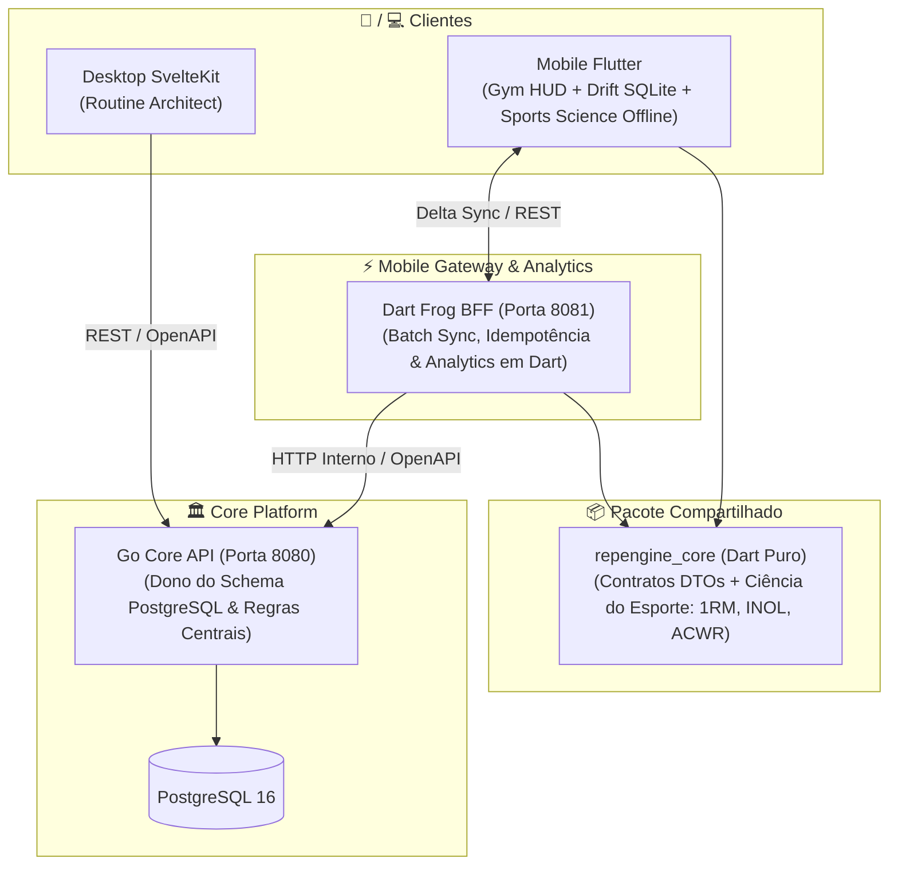

# RepEngine Mobile: Roadmap & Sprints (Flutter + Dart Frog BFF)

## 🎯 Visão do Produto & Estratégia de Engenharia

O objetivo deste projeto é construir um **produto mobile de nível sênior em Flutter e Dart**, focado em resolver um dos problemas mais difíceis da computação móvel: **Offline-First Synchronization com resolução determinística de conflitos**.

O app mobile atuará como o **Gym Execution HUD** da plataforma RepEngine, complementando o **Routine Architect (Desktop Web em SvelteKit)** sem qualquer regressão ou quebra no sistema existente.

---

## 🏛️ Arquitetura do Sistema e Fronteiras de Responsabilidade

### Fronteira Clara entre Serviços:
*   **Go Core API (Porta 8080)**:
    - Dono exclusivo do schema PostgreSQL e das migrations.
    - Aplica regras de negócio centrais, autenticação de sessão e travas concorrentes (advisory locks).
    - Expõe a especificação OpenAPI (`/swagger/openapi.yaml`).
*   **Dart Frog BFF (Porta 8081)**:
    - **NÃO toca no PostgreSQL diretamente**: consome a API do Go Core via rede interna do Docker.
    - Atua como gateway especializado para mobile: recebe lotes de mutações, garante idempotência via `client_id` (UUID), desempacota lotes em requisições atômicas e prepara respostas delta enxutas.
*   **Flutter App (`mobile/`)**:
    - Aplicação nativa (Android/iOS) baseada em **Riverpod 2.x** e **Drift (SQLite local)**.
    - Padrão **Outbox (Fila de Mutações)**: grava tudo no SQLite local primeiro; sincroniza em segundo plano quando houver conexão.

### 🌐 Ciclo de Sincronização Inteligente (PC Local ↔ Modo Academia)
*   **1. Em Casa (Mesmo Wi-Fi do PC / Docker Ativo)**:
    - O app Flutter detecta automaticamente o backend via heartbeat no IP configurado.
    - Dispara o *Pull*: baixa rotinas novas/editadas no PC e os estados de progressão atuais (`progression_states` com cargas sugeridas e semanas ativas).
*   **2. Na Academia (Modo Offline / Sem PC)**:
    - O app opera com total autonomia e latência zero (0ms) no SQLite local.
    - O atleta executa treinos, consulta cargas prescritas e tem os incrementos de progressão calculados localmente no Flutter caso faça múltiplos treinos seguidos sem ligar o PC.
    - Cada série finalizada é inserida na `SyncQueueTable` com UUID v4 idempotente.
*   **3. Ao Retornar para Casa ou Subir o Docker no PC**:
    - Assim que os containers do Docker sobem no PC ou o celular entra no Wi-Fi, o worker detecta o servidor ativo e faz o *Push* em lote silencioso, descarregando as séries no PostgreSQL.

---

## 📋 Plano de Sprints

### 🛠️ SPRINT 0: Revisão de Schema & Evolução no Go Core
> **Objetivo**: Garantir que o banco de dados central suporte sincronização distribuída e idempotência sem regressão dos dados já persistidos.

- [x] **Auditoria de Schema**:
  - Verificar índices únicos e colunas existentes (`workout_set_logs.block_client_id`, `workflows.updated_at`).
- [x] **Migration Go Core `017_offline_sync_support.sql`**:
  - `ALTER TABLE workout_sessions ADD COLUMN IF NOT EXISTS client_id VARCHAR(100);` com índice único parcial.
  - `ALTER TABLE workflows ADD COLUMN IF NOT EXISTS deleted_at TIMESTAMP WITH TIME ZONE;` com índice.
  - `ALTER TABLE workout_set_logs ADD COLUMN IF NOT EXISTS client_id VARCHAR(100);` com índice único parcial.
- [x] **Verificação**:
  - Migrações automáticas aplicadas com sucesso no Go, queries e handlers atualizados com suporte a `client_id`, testes 100% aprovados.

---

### 📦 SPRINT 1: Geração de DTOs do OpenAPI & Pacote Compartilhado (`packages/repengine_core`)
> **Objetivo**: Estabelecer tipagem estática ponta a ponta sem duplicação manual de código entre Dart Frog e Flutter.

- [x] **Alinhamento com Contrato OpenAPI**:
  - OpenAPI [`openapi/openapi.yaml`](file:///home/mateus/Projects/repengine/openapi/openapi.yaml) atualizado com `client_id` e `deleted_at`.
- [x] **Pacote Compartilhado `packages/repengine_core`**:
  - Modelos de domínio e envelopes do protocolo de sincronização implementados em Dart puro (`lib/repengine_core.dart`):
    - `Workflow` e `WorkflowBlock`: Modelagem de rotinas do treinador com suporte a soft-delete.
    - `WorkoutSession` e `WorkoutSetLog`: Modelagem com identificador de cliente (`client_id`).
    - `SyncPushPayload`: Lote com sessões e séries concluídas offline pelo atleta.
    - `SyncPushResult` e `SyncPushItemStatus`: Recibo com status por item (`accepted`, `ignoredDuplicate`, `conflictFlagged`).
    - `SyncPullRequest`: Requisição com timestamp `last_synced_at`.
    - `SyncPullResponse`: Resposta delta com workflows atualizados e IDs de rotinas deletadas.
- [x] **Integração no Mobile & Testes da Sprint**:
  - App [`mobile/`](file:///home/mateus/Projects/repengine/mobile) configurado com arquitetura Feature-First e importando `repengine_core`.
  - Testes unitários de serialização em Dart (`dart test`) e testes de widget (`flutter test`) 100% aprovados sem alertas de análise.

---

### 🚀 SPRINT 2: Dart Frog BFF & Motor de Sincronização
> **Objetivo**: Construir o gateway de sincronização mobile em Dart Frog rodando no Docker.

- [x] **Estrutura Dart Frog**:
  - Configuração do projeto Dart Frog com injeção de dependência (`repengine_core`, client HTTP interno do Go Core).
  - Middleware de autenticação JWT compartilhando o mesmo segredo do Go.
- [x] **Endpoints de Sincronização**:
  - `POST /api/v1/mobile/sync/push`:
    - Recebe lote de mutações do Flutter.
    - Deduplicação por `client_id` (idempotência).
    - Despacha chamadas para o Go Core (`/workflows/:id/sessions`, `/workout-sessions/:id/logs`).
  - `GET /api/v1/mobile/sync/pull`:
    - Busca dados recentes no Go Core e devolve o delta filtrado por `updated_at`.
- [x] **Integração Docker**:
  - Adicionar o serviço `mobile-bff` ao `docker-compose.dev.yml` (porta 8081).
- [x] **Testes da Sprint**:
  - Testes de integração em Dart simulando retransmissão de lote para provar idempotência.

---

### 📱 SPRINT 3: Flutter Base, Riverpod 2.x & Drift (SQLite Local)
> **Objetivo**: Fundação do app Flutter com arquitetura Feature-First, banco local reativo e injeção de dependências.

- [x] **Configuração do Projeto Flutter & Design Tokens**:
  - Setup do projeto `mobile/` com Riverpod 2.x (`ProviderScope`, `@riverpod`) e `go_router`.
  - Design tokens (Atelier Dark Theme, tipografia Space Grotesk / Manrope).
- [x] **Drift Local Database (`AppDatabase`)**:
  - Tabelas: `RoutinesTable`, `WorkoutSessionsTable`, `WorkoutSetLogsTable`.
  - Tabela **`SyncQueueTable`**: `id`, `entity_client_id`, `entity_type`, `action`, `payload`, `status`, `attempts`.
  - Consultas reativas com **Streams (`watch()`)**: a UI escuta o Drift diretamente.
- [x] **Camada de Repositório**:
  - `WorkoutRepository`: Leitura sempre no Drift local (latência zero); escrita salva no Drift e insere na fila de sync.
- [x] **Testes da Sprint**:
  - Testes unitários de repositório e banco Drift em memória (`NativeDatabase.memory()`).

---

### ⚡ SPRINT 4 (Fatia Vertical 1): Gym Execution HUD + Ciência do Esporte (1RM/Fadiga) em Tempo Real
> **Objetivo**: Unir a interface visual do Flutter com o motor local Drift e a matemática de 1RM do `repengine_core`. O atleta inicia um treino, digita carga/reps, vê o 1RM estimado sendo calculado em tempo real na tela, conclui séries com feedback tátil e vê a lista e o timer reagirem ao vivo a 120 FPS.

- [x] **Módulo `repengine_core/sports_science` (1RM, INOL, ACWR & Autoregulação)**:
  - Fórmulas analíticas (Brzycki, Epley, Mayhew, Wathen, Lombardi), zonas de recuperação INOL, ratio ACWR e motor de autorregulação por RPE em Dart puro.
  - Testes unitários puros com 100% de paridade com o Python (`dart test` aprovado com 9 testes).
- [x] **Interface do Gym Execution HUD (`mobile/lib/features/workout_execution/presentation/`)**:
  - Tela principal com header da sessão ativa e cards de exercícios com o tema Atelier Dark.
  - Componente ergonômico *Thumb Zone* com inputs de Carga e Reps.
  - Botão "Concluir Série" disparando gravação atômica no SQLite via `WorkoutRepository`.
  - Lista reativa de séries concluídas atualizando via `StreamProvider`.
  - Modal de resumo de conclusão de treino (`WorkoutSummaryDialog`) com volume total (kg) e tempo.
- [x] **Cronômetro Circular em Canvas (`CustomPainter`)**:
  - Timer de descanso animado desenhado em Canvas nativo a 120 FPS sem rebuild desnecessário da árvore.
  - `HapticFeedback` vibratório nos 3 segundos finais do descanso.
- [ ] **Conexão Direta do Módulo de 1RM no Flutter**:
  - Conectar `OneRepMaxCalculator` no `ThumbZonePad` e `SetLogCard` para cálculo de consenso estatístico em tempo real.

---

### 🐍 ➔ 🎯 SPRINT 4.5: Exposição no Dart Frog BFF & Substituição do Python no Desktop Web
> **Objetivo**: Fazer a Web Desktop (SvelteKit) consumir o módulo de Ciência do Esporte em Dart através do Dart Frog BFF, possibilitando o desligamento e remoção definitiva do contêiner Python do Docker Compose.

- [x] **Endpoints Analíticos no Dart Frog BFF (`server_mobile/routes/api/v1/`)**:
  - `POST /api/v1/1rm`: Consome `OneRepMaxCalculator` e retorna o mesmo JSON que o Python retornava.
  - `POST /api/v1/autoregulation`: Consome `AutoregulationEngine` formatando ações para snake_case (`increase_load`, etc.).
  - `POST /api/v1/acwr`: Consome `ACWRCalculator` com zonas ótimas e recomendações.
  - Validação via testes de integração e chamadas `curl`.
- [x] **Virada de Chave no Desktop Web (SvelteKit)**:
  - Atualizar `docker-compose.dev.yml` para apontar `ANALYTICS_URL: http://mobile-bff:8080`.
  - Confirmar renderização do card `ScientificInsights` na Web sem alterar uma linha sequer de Svelte/HTML.
- [x] **Descomissionamento do Microsserviço Python**:
  - Remover serviço `analytics` do `docker-compose.dev.yml` (economia de ~200MB de RAM e menos complexidade de deploy).

---

### 🔄 SPRINT 5 (Fatia Vertical 2): Sincronização Inteligente Ponta a Ponta (Outbox Worker ↔ Dart Frog BFF) & Status Visual
> **Objetivo**: Conectar o SQLite local com o Dart Frog BFF via rede local, viabilizando o fluxo "planeja no PC ➔ executa offline na academia ➔ sincroniza automaticamente ao reconectar", incluindo a descida e continuidade das progressões e ferramentas de diagnóstico.

- [x] **Configuração Dinâmica do Host do PC & Health Check**:
  - Persistência do IP local da máquina via `shared_preferences` (`ServerConfigNotifier`).
  - Endpoint `GET /api/v1/health` ativo no BFF e botão de teste de Ping com latência na UI.
- [x] **Indicador Visual de Nuvem & "Modo Academia" (Cloud Sync Badge)**:
  - Widget na AppBar observando status da rede e fila Drift (🟢 Sincronizado, 🟡 Modo Academia, 🔵 Testando, ⚪ PC Offline).
- [x] **Painel de Diagnóstico Oculto & Ajustes de Rede (Debug & Settings Drawer)**:
  - Gaveta com edição de IP, teste de ping, simulação de offline e inspetor da fila local `SyncQueueTable`.
- [ ] **Worker de Sincronização Inteligente (`SyncEngine` & `SyncHttpClient`)**:
  - Monitoramento de conectividade (`connectivity_plus`) e auto-sync ao reconectar.
  - Varredura da `SyncQueueTable` do Drift e despacho em lote para `POST /api/v1/mobile/sync/push`.
  - Confirmação e expurgo atômico dos itens enviados da fila local com base no recibo `SyncPushResult`.
  - Disparo de `GET /api/v1/mobile/sync/pull` para buscar rotinas e novidades do servidor.
- [ ] **Sincronização e Continuidade de Progressões (`progression_states`)**:
  - DTO de `ProgressionState` no `repengine_core` e retorno no `SyncPullResponse`.
  - Persistência de cargas sugeridas no Drift local (`ProgressionStatesTable`).
  - Fallback offline para cálculo de incremento linear no Flutter quando múltiplos treinos forem executados longe do PC.
    - Inspecionar itens acumulados na fila SQLite (`SyncQueueTable`).
    - Simular falhas de rede e modo offline forçado.

---

### 🏆 SPRINT 6 (Fatia Vertical 3): Conflito Real Aluno x Treinador, Golden Tests & CI/CD
> **Objetivo**: Finalizar o produto com reconciliação determinística de conflitos, cobertura de regressão visual e esteira automatizada de release do APK.

- [ ] **Resolução Determinística de Conflitos no Dart Frog**:
  - Cenário concorrente real: Treinador edita no SvelteKit ↔ Aluno conclui série offline.
  - Regra de negócio: esforço físico do atleta nunca é descartado; rotina é atualizada para a nova versão com aviso amigável.
- [ ] **Testes Visuais (Golden Tests) & CI/CD**:
  - Testes visuais automatizados com `alchemist` garantindo layout perfeito em temas escuro/claro e telas pequenas.
  - Pipeline no GitHub Actions gerando `app-release.apk`.
- [ ] **README do Portfólio**:
  - QR Code para download direto do APK.
  - Demonstração em vídeo lado a lado: Desktop Web x Celular em Modo Avião.

