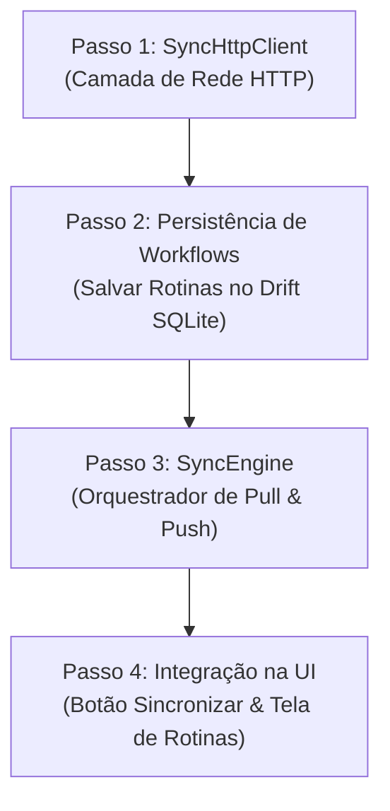

# 🎓 Tutorial Prático — SPRINT 5: Motor de Sincronização Offline-First
> **Guia Passo a Passo de Engenharia**: Do Padrão Outbox no SQLite ao Delta Sync no Dart Frog BFF.

---

## 🎯 1. O Grande Desafio: Por que Sincronização Mobile é Difícil?

Na maioria dos aplicativos tradicionais, a arquitetura é **Online-First**:
```text
[Usuário Clica] ──> [Requisição HTTP] ──> [Servidor Salva] ──> [Resposta 200] ──> [UI Atualiza]
```
Se a internet da academia oscilar, ou você estiver no subsolo sem sinal 4G:
❌ O app trava em um loading infinito;  
❌ O botão falha com erro de timeout;  
❌ O atleta perde o registro da série levantada ou a carga prescrita.

No **RepEngine**, adotamos a arquitetura **Offline-First (Local-First)**:
```text
                               ┌──────────────────────────────────────────────────────────┐
                               │                    CELULAR (0ms LATÊNCIA)                │
                               │                                                          │
[Usuário Clica] ──────────────>│ 1. Salva Série no SQLite Local (WorkoutSetLogsTable)     │
                               │ 2. Enfileira Mutação no Outbox (SyncQueueTable)         │
                               │ 3. UI Reage Instantaneamente via Streams (Drift watch)  │
                               └────────────────────────────┬─────────────────────────────┘
                                                            │
                                         [Quando houver Wi-Fi / Conexão com PC]
                                                            │
                                                            ▼
                               ┌──────────────────────────────────────────────────────────┐
                               │                   DART FROG BFF & GO CORE                │
                               │                                                          │
                               │ 4. Worker envia lote idempotente (POST /sync/push)       │
                               │ 5. Servidor responde recibo com status por item          │
                               │ 6. App expurga itens confirmados da fila local           │
                               │ 7. App puxa novidades do servidor (GET /sync/pull)       │
                               └──────────────────────────────────────────────────────────┘
```

---

## 🏛️ 2. Os Três Pilares da Engenharia Offline-First

### Pilar 1: O Padrão Outbox Transacional
Toda vez que você toca em "Concluir Série":
- A gravação da série na `WorkoutSetLogsTable` e a criação do registro na `SyncQueueTable` acontecem na **mesma transação do SQLite**.
- Se a bateria acabar no milissegundo seguinte, ou o app for fechado pelo sistema operacional, a integridade dos dados é 100% preservada.

### Pilar 2: Idempotência com UUIDs (`client_id`)
Como a rede móvel é instável, o aplicativo pode reenviar um lote se a resposta HTTP for perdida no caminho.
- Se usássemos IDs autoincrementais do servidor (`id: 1, 2, 3`), o servidor salvaria a mesma série duas vezes!
- Com o **`client_id` (UUID v4 gerado no celular)**: se o servidor receber a mesma série 10 vezes, ele detecta que aquele `client_id` já foi persistido e responde com `ignoredDuplicate` sem duplicar seu treino.

### Pilar 3: Delta Synchronization (`last_synced_at`)
Ao buscar rotinas no servidor, o celular não baixa todo o banco de dados de novo:
- Ele envia `GET /api/v1/mobile/sync/pull?last_synced_at=2026-10-07T12:00:00Z`.
- O servidor retorna apenas o que foi alterado ou deletado após esse instante.
- Resultado: sincronização em poucos milissegundos com consumo mínimo de dados móveis e bateria.

---

## 🗺️ 3. O Mapa de Implementação da Sprint 5

Para implementar a Sprint 5 com maestria, dividimos o trabalho em 4 passos lógicos:



---

## 📦 Passo 1: O Cliente HTTP de Rede (`SyncHttpClient`)

### Onde ele vive?
📁 `mobile/lib/features/sync/data/sync_http_client.dart`

### O que ele faz?
Ele é responsável por fazer as chamadas HTTP reais para o Dart Frog BFF:
1. **`pullWorkflows({DateTime? lastSyncedAt})`**:
   - Monta a URL: `$baseUrl/api/v1/mobile/sync/pull?last_synced_at=...`
   - Envia o header `Authorization: Bearer <token>`
   - Converte o JSON de resposta para o nosso DTO [`SyncPullResponse`](file:///home/mateus/Projects/repengine/packages/repengine_core/lib/src/sync/sync_pull_response.dart).
2. **`pushMutations(SyncPushPayload payload)`**:
   - Monta a URL: `$baseUrl/api/v1/mobile/sync/push`
   - Envia o payload com as sessões e séries concluídas offline
   - Converte a resposta para o DTO [`SyncPushResult`](file:///home/mateus/Projects/repengine/packages/repengine_core/lib/src/sync/sync_push_result.dart).

---

## 💾 Passo 2: Persistência no SQLite (`WorkoutRepository` / `RoutinesTable`)

### O que o celular precisa guardar?
Quando o `pull` traz os `updated_workflows`, precisamos gravar:
- O nome da rotina (ex: "Treino A - Superior", "GZCLP");
- A descrição e quantidade de blocos;
- Os blocos de exercícios de cada dia da rotina.

No nosso banco local Drift ([`AppDatabase`](file:///home/mateus/Projects/repengine/mobile/lib/core/database/app_database.dart)), a tabela `RoutinesTable` armazena esses dados com o ID idêntico ao do PostgreSQL no servidor.

---

## ⚡ Passo 3: O Maestro em Segundo Plano (`SyncEngine`)

### Onde ele vive?
📁 `mobile/lib/features/sync/application/sync_engine.dart`

### Ciclo de Execução:
1. **Verificação de Rede**: Confere se o servidor está online (`serverHealthProvider.isOnline`). Se offline, encerra em silêncio.
2. **Fase Push (Descarregar fila local)**:
   - Lê todos os registros pendentes da `SyncQueueTable`.
   - Empacota em um `SyncPushPayload`.
   - Envia para `POST /sync/push`.
   - Para cada item confirmado pelo servidor com status `accepted` ou `ignoredDuplicate`: **deleta da fila local** (expurgo atômico).
3. **Fase Pull (Baixar novidades)**:
   - Lê o último `last_synced_at` gravado nas preferências locais.
   - Envia `GET /sync/pull?last_synced_at=...`.
   - Atualiza ou insere as rotinas no SQLite local.
   - Atualiza o timestamp do último sync.

---

## 📱 Passo 4: Integração com a UI & Experiência do Atleta

1. **No Drawer de Diagnóstico**:
   - O botão **"Sincronizar Agora"** dispara `ref.read(syncEngineProvider).syncNow()`.
2. **Na AppBar (Cloud Sync Badge)**:
   - O ícone muda de cor automaticamente:
     - 🟡 **Modo Academia** quando há itens acumulados na fila offline;
     - 🔵 **Sincronizando...** durante o tráfego de rede;
     - 🟢 **Sincronizado** quando a fila é zerada e os dados estão salvos na nuvem!
3. **Na Tela Inicial**:
   - Em vez de um mock estático, a lista de rotinas é alimentada diretamente pelo Stream `watchRoutines()` do SQLite.

---

## 🏁 Próximo Passo do Tutorial
Vamos implementar o **Passo 1 (`SyncHttpClient`)** juntos, examinando o código, os tipos e como os contratos do `repengine_core` garantem segurança de tipos sem duplicação de modelos!
